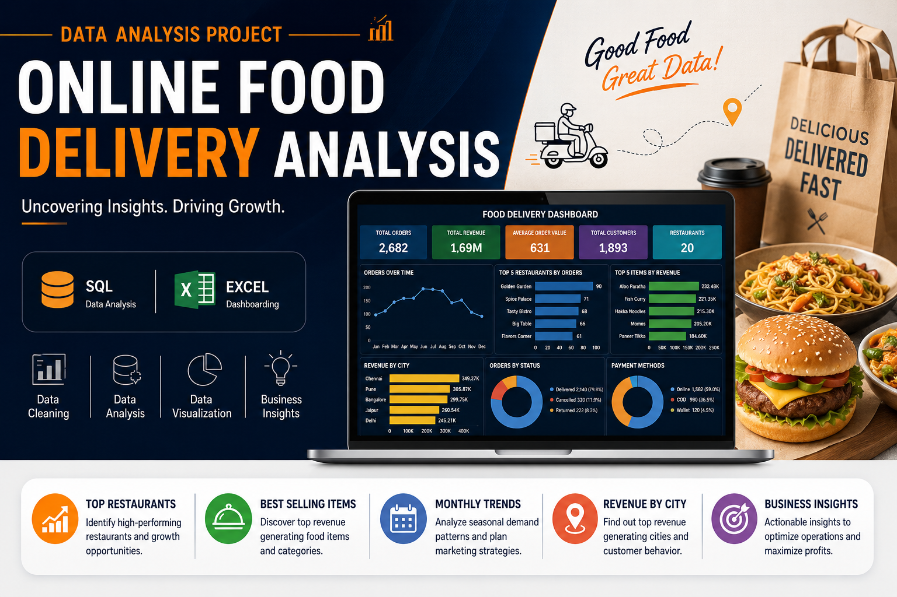
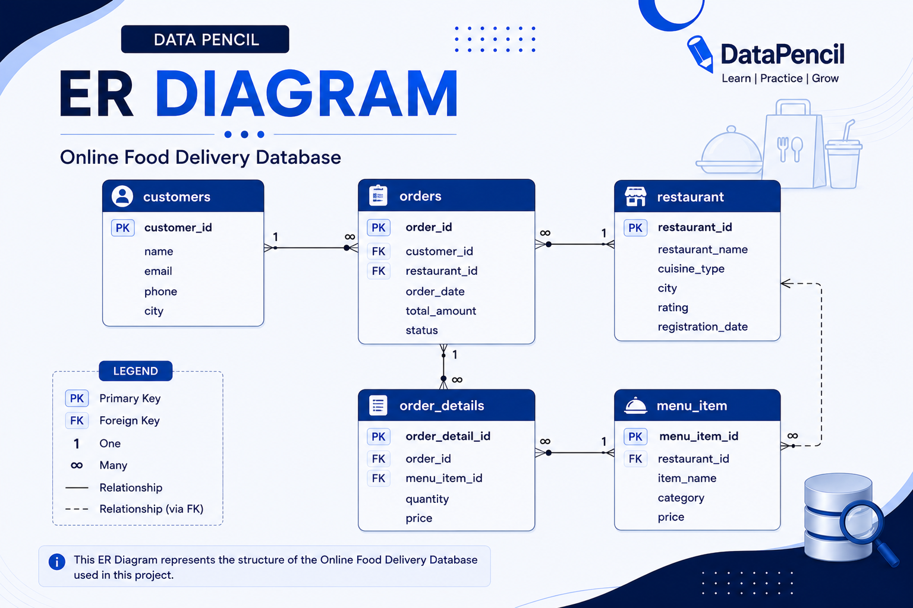
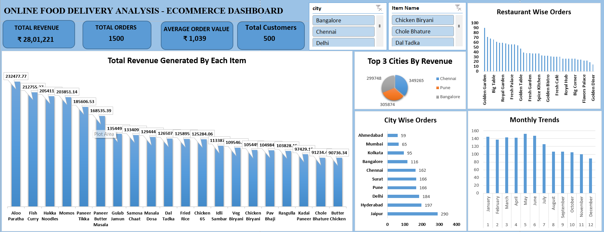

# 🍔 Online Food Delivery Analysis | SQL & Excel Data Analytics Project

> **End-to-end food delivery business analysis** — customer behavior, restaurant performance, revenue trends, and city-wise sales insights using SQL and an interactive Excel dashboard.



[](https://github.com/YashPrajapati989)
[](https://github.com/YashPrajapati989)
[](https://github.com/YashPrajapati989)
[](https://www.linkedin.com/in/yash-prajapati-2b99392b8)

---

## 📌 Project Overview

This project delivers a **complete data analytics case study** on an Online Food Delivery business using **SQL and Microsoft Excel**. It uncovers actionable insights around customer behavior, restaurant performance, sales trends, and revenue-driving opportunities across multiple Indian cities.

This project is ideal for anyone learning:
- **SQL for business analytics and reporting**
- **Excel dashboard design with Pivot Tables and Charts**
- **Food delivery domain analysis**
- **Restaurant performance benchmarking**
- **Customer behavior and revenue trend analysis**

The project follows a **complete, end-to-end data analytics workflow** — making it an excellent addition to any **data analyst portfolio**.

**Keywords:** online food delivery analysis SQL, food delivery data analytics project, SQL Excel dashboard project, restaurant performance analysis SQL, data analyst portfolio project, food delivery EDA SQL, Excel pivot table dashboard, revenue analysis SQL, customer behavior analysis SQL

---

## 🛠️ Tools & Technologies Used

| Tool | Purpose |
|---|---|
| **SQL** | Data cleaning, modeling, EDA, and business queries |
| **Microsoft Excel** | Interactive dashboard design and data visualization |
| **Pivot Tables** | Summarizing and slicing multi-dimensional data |
| **Pivot Charts** | Visual representation of key metrics |
| **Dashboard Design** | Consolidated KPI and trend reporting |
| **Data Visualization** | Translating data into business-ready visuals |

---

## 📂 Dataset Description

### Dataset Summary

| Metric | Value |
|---|---|
| Dataset Name | Online Food Delivery Dataset |
| Number of Tables | 5 |
| Total Rows | 5,000 |
| Domain | Food & Restaurant Industry |
| Analysis Type | Sales, Customer, Revenue, Trend |

### Tables Overview

| Table | Description |
|---|---|
| `customers` | Customer details — ID, name, city, demographics |
| `orders` | Order-level transaction data — date, restaurant, total |
| `order_details` | Line-item data — menu items, quantities per order |
| `menu_item` | Menu items, categories, and pricing |
| `restaurant` | Restaurant information, location, and city |

---

## 🗄️ Database Schema & ER Diagram

The five tables are related through primary and foreign keys, enabling multi-table joins for comprehensive business queries.



**Key relationships:**
- `customers` → `orders` via `customer_id`
- `orders` → `order_details` via `order_id`
- `order_details` → `menu_item` via `item_id`
- `orders` → `restaurant` via `restaurant_id`

---

## 🧹 Data Cleaning & Preparation

Before analysis, the dataset was thoroughly cleaned and validated:

- 🔍 Identified and removed **NULL and duplicate records**
- ✔️ Validated **foreign key relationships** across all 5 tables
- 📐 Standardized **data types** for dates, prices, and IDs
- 🔗 Verified **referential integrity** between orders, customers, and restaurants
- 🧪 Prepared a **clean, join-ready relational dataset**

---

## 📊 Interactive Excel Dashboard

The final deliverable includes a fully interactive Excel dashboard for business stakeholders — no SQL required to explore the insights.



**Dashboard features:**
- 📌 KPI summary cards (total revenue, total orders, top city, top restaurant)
- 📊 Monthly order trend chart
- 🏙️ City-wise revenue breakdown
- 🍽️ Top menu items by revenue
- 🏪 Restaurant performance comparison
- 🔽 Interactive slicers for filtering by city, month, and category

---

## 🔍 SQL Business Questions Answered

### 🍽️ Menu & Revenue Analysis
- Which menu items generate the **highest total revenue**?
- What is the **average order value** per item?
- Which categories (veg/non-veg) drive more sales?

### 🏪 Restaurant Performance Analysis
- Which restaurants have the **highest order volumes**?
- What is the **revenue contribution** per restaurant?
- Which restaurants are **underperforming** relative to their city?

### 👥 Customer Behavior Analysis
- How many **unique customers** placed orders?
- What is the **order frequency** per customer?
- Which cities have the **highest spending customers**?

### 📅 Time & Trend Analysis
- Which **months drive peak sales**?
- What are the **seasonal demand patterns**?
- How does revenue trend **month-over-month**?

### 🏙️ City-wise Sales Analysis
- Which cities generate the **most revenue**?
- How does **customer spending vary by city**?
- Which cities have the best **restaurant density vs. order volume** ratio?

---

## 📈 Key Business Insights

### 🥘 Top Revenue-Generating Menu Items
- **Aloo Paratha** generated the highest individual item revenue across all orders.
- **Fish Curry, Hakka Noodles, and Momos** each crossed the ₹200K revenue mark.
- **Paneer-based dishes** consistently performed well, indicating strong vegetarian demand.

### 🏪 Restaurant Performance
- **Golden Garden** recorded the highest order volumes across the dataset.
- **Spice Palace, Tasty Bistro, and Big Table** followed closely as top performers.
- **Golden Diner and Royal Kitchen** showed the lowest order volumes — candidates for operational review.

### 📅 Monthly Sales Trends
- **May** was the highest-performing month overall.
- The **January–June** period maintained consistently strong demand.
- **December** recorded the lowest orders — an opportunity for seasonal campaigns.

### 🏙️ Top Revenue Cities
- **Chennai** generated the highest total revenue, showing strong urban food delivery adoption.
- **Pune and Bangalore** followed closely, with high average spending per customer.
- These three cities represent the **primary growth markets** for the business.

---

## 🎯 Business Recommendations

Based on the analysis, the following data-driven strategies are recommended:

1. **Menu Optimization** — Promote high-revenue dishes (Aloo Paratha, Fish Curry, Momos) across underperforming restaurants to lift their average order value.
2. **Restaurant Strategy** — Replicate the operational model of top-performing restaurants (Golden Garden, Spice Palace) across lower-volume outlets.
3. **Seasonal Campaigns** — Launch targeted promotions during low-demand months (especially December) to reduce seasonality impact.
4. **City-Focused Investment** — Prioritize premium offerings and marketing spend in Chennai, Pune, and Bangalore — the top revenue-generating cities.
5. **Customer Retention** — Identify repeat customers and reward loyalty through personalized offers to increase lifetime value.

---

## 🚀 Project Outcomes

| Deliverable | Status |
|---|---|
| ✔ Restaurant Performance Analysis | Completed |
| ✔ Revenue Analysis by Item & Category | Completed |
| ✔ City-wise Sales Analysis | Completed |
| ✔ Monthly Trend Analysis | Completed |
| ✔ Interactive Excel Dashboard | Completed |
| ✔ Actionable Business Recommendations | Completed |

---

## 🎓 Skills Demonstrated

This project showcases real-world skills sought by hiring managers for **Data Analyst**, **Business Analyst**, and **BI Analyst** roles:

- ⚙️ **SQL Query Writing** — multi-table JOINs, aggregations, subqueries
- 🧹 **Data Cleaning & Validation** across relational tables
- 🔎 **Exploratory Data Analysis (EDA)** using SQL
- 📊 **Excel Dashboard Design** with Pivot Tables and Charts
- 🏙️ **Geographic Sales Analysis** (city-wise revenue breakdown)
- 📅 **Time-Series & Trend Analysis** (monthly patterns)
- 💡 **Business Recommendations** grounded in data
- 🤝 **Stakeholder-Ready Reporting** via interactive dashboard

---

## 📂 Project Structure

```
Online-Food-Delivery-Analysis/
│
├── SQL/
│   └── food_delivery_analysis.sql   ← All SQL queries
├── Excel/
│   └── Dashboard.xlsx               ← Interactive Excel dashboard
├── images/
│   ├── cover.png                    ← Project cover image
│   ├── er_diagram.png               ← Database ER diagram
│   └── Dashboard.png                ← Dashboard preview screenshot
└── README.md                        ← Project documentation (you are here)
```

---

## 🔗 Related Topics & Tags

`sql` `excel` `data-analysis` `food-delivery` `restaurant-analytics` `business-intelligence` `exploratory-data-analysis` `pivot-tables` `excel-dashboard` `customer-behavior` `revenue-analysis` `sales-trend-analysis` `data-visualization` `portfolio-project` `data-cleaning` `eda` `mysql` `postgresql` `data-analyst-portfolio` `business-analytics`

---

## 👨‍💻 Author

**Yash Prajapati**  
*Aspiring Data Analyst | SQL | Excel | Data Analytics | Business Intelligence*

### 🌐 Connect With Me

| Platform | Link |
|---|---|
| 💼 LinkedIn | [linkedin.com/in/yash-prajapati-2b99392b8](https://www.linkedin.com/in/yash-prajapati-2b99392b8) |
| 🐙 GitHub | [github.com/YashPrajapati989](https://github.com/YashPrajapati989) |

---

> ⭐ **If you found this project helpful, consider giving it a star!** It helps others discover the project and motivates continued open-source contributions.